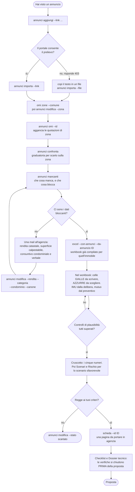

# Valutazione di un investimento immobiliare

Strumento locale per valutare l'acquisto di un immobile residenziale in Italia, nelle tre destinazioni possibili: abitazione propria, messa a reddito, investimento puro. Produce un workbook Excel di ventun fogli con formule vive, un registro degli immobili in valutazione, una scheda di una pagina da portare in trattativa e una trattazione matematica di trentadue pagine che deriva ogni formula del modello.

Nasce da una decisione reale e non da un esercizio, e questo spiega due sue caratteristiche. La prima è che ogni numero porta la fonte e la data di verifica: nessun parametro fiscale entra nel modello senza una fonte citata, e le lacune sono elencate invece di essere taciute. La seconda è che i limiti sono dichiarati nella cella che li produce, non in una nota in fondo: un limite scritto dove il numero si legge è un presidio, mentre un limite scritto in un documento che nessuno apre è un alibi.

Licenza MIT. Le aliquote implementate sono quelle vigenti alla data di revisione dichiarata in `src/immobiliare/parametri.py`, oggi il 28 agosto 2026, e cambiano con ogni legge di bilancio.

---

## Indice

- [A che domande risponde](#a-che-domande-risponde)
- [Che cosa produce](#che-cosa-produce)
- [Installazione](#installazione)
- [Il percorso operativo](#il-percorso-operativo)
- [I comandi](#i-comandi)
- [Architettura](#architettura)
- [Il modello di calcolo](#il-modello-di-calcolo)
- [Le fonti dei dati](#le-fonti-dei-dati)
- [Verifica e test](#verifica-e-test)
- [La documentazione](#la-documentazione)
- [Perimetro, e cosa resta fuori](#perimetro-e-cosa-resta-fuori)
- [Vincoli sui dati](#vincoli-sui-dati)
- [Limiti dichiarati](#limiti-dichiarati)

---

## A che domande risponde

Tre, e tutto il resto ne discende.

**Quanta cassa serve davvero per chiudere.** Non il prezzo: il prezzo più imposte di trasferimento, notaio, provvigione e oneri del mutuo. Su un immobile da centoventimila euro il costo reale sta attorno ai centotrentaduemila, e quei dodicimila non tornano alla rivendita. È la ragione per cui ogni rendimento del modello ha come denominatore il costo totale e non il prezzo: usare il prezzo gonfia il risultato di circa un decimo, e lo gonfia sempre nella stessa direzione, cosa peggiore di un errore rumoroso.

**Quanto rende al netto di tutto,** e come si confronta con il non comprare. Fra il rendimento lordo degli annunci e il rendimento netto si perdono di norma due punti e mezzo. Il modello riporta anche il rendimento **reale**, cioè al netto dell'inflazione, con l'equazione di Fisher in forma esatta e non con la sottrazione: sul caso di riferimento il rendimento netto passa da più 0,52 per cento nominale a meno 1,45 reale, e il tasso interno da più 0,40 a meno 1,56. Un modello che riporta solo il nominale non è impreciso: risponde a una domanda diversa da quella che gli si pone.

**Quali verifiche vanno chiuse prima di firmare.** Una proposta accettata è già un contratto vincolante: le verifiche si chiudono prima, oppure diventano condizioni scritte nella proposta. Il workbook porta trenta verifiche divise per fase e settantatré documenti da farsi consegnare, ciascuno con la norma che lo rende dovuto.

## Che cosa produce

### Il workbook, ventun fogli

Venti visibili più uno nascosto, con **formule vive**: il file non è un rapporto ma il modello stesso, e chi lo apre cambia una cella e vede ricalcolare tutto. La scelta ha un costo dichiarato, cioè che le formule non si valutano alla scrittura, e da quel costo nasce la procedura di verifica descritta più sotto.

Il primo foglio è un **indice navigabile**: i venti fogli raggruppati in otto fasi del percorso, con un collegamento a ciascuno e, per ognuno, se si compila o si legge, quando si apre e che cosa ne esce. Da ogni foglio si torna all'indice. Le celle hanno cinque colori con significati distinti: giallo si scrive, azzurro si sceglie da un elenco, grigio è calcolato, verde è un risultato, rosso è un'attenzione.

I fogli, per gruppo. **Cruscotto**, i cinque numeri che decidono con la soglia accanto a ciascuno. **Immobile, Mutuo, Locazione, Comproprietà**, gli input. **Ammortamento** con il piano rata per rata fino a quarant'anni, **Simulatore mutuo** con rimborsi volontari e percorso del tasso a gradini, **Cash flow** con la proiezione annuale. **Metriche** con tutti gli indicatori e l'effetto dell'inflazione componente per componente, **Confronto affitto**, **Scenari** con tre ipotesi e il prezzo massimo sostenibile, **Rischio** con mille scenari e l'analisi a tornado. **Checklist** e **Dossier tecnico** per la fase di proposta. **Asta** per le vendite giudiziarie. **Annunci** e **Confronto immobili** per la ricerca. **Parametri** e **Fonti** come riferimento.

### Il registro degli immobili

Un CSV di trentacinque campi, un immobile per riga, che alimenta il foglio Confronto immobili. Riconosce i duplicati per link normalizzato, verifica il `robots.txt` prima di ogni prelievo, e dichiara per riga il regime di acquisto, cioè prima casa e venditore impresa, con il vuoto come terzo stato che significa eredita dal foglio Immobile.

### La scheda di trattativa

Una pagina PDF con i quattro numeri che servono in agenzia: costo reale, rendimento netto reale, prezzo massimo sostenibile e sconto da ottenere, più l'elenco dei dati che mancano. Calcola con il motore Python e non legge il workbook, quindi è un terzo riscontro della stessa matematica invece di una copia. Non stampa i numeri che dipendono da un dato assente: senza canone atteso il prezzo massimo non è calcolabile e la casella lo dice, invece di contenere una cifra.

### La trattazione matematica

`docs/matematica/matematica-finanziaria.tex`, trentadue pagine, si compila con gli script del progetto. Formalizza ogni calcolo partendo dalle definizioni, con un capitolo iniziale che spiega la notazione a chi non è abituato alle formule e una lettura a parole di ogni formula, chiusa da un numero concreto. Contiene la tavola che lega ventotto simboli alla cella del workbook e alla funzione Python, il caso di riferimento svolto con ventiquattro valori verificati, e l'elenco dei limiti.

## Installazione

Python della serie 3.13 e una sola dipendenza obbligatoria.

```
python -m pip install openpyxl
```

Excel installato serve alla sola verifica del workbook, che consiste nell'aprirlo con il programma che lo interpreterà davvero. Senza Excel il progetto funziona: si perde quel controllo, e i test automatici restano eseguibili.

Un'istanza [Ollama](https://ollama.com/) raggiungibile serve alla sola strutturazione di un annuncio incollato, ed è opzionale in senso forte: se non risponde il comando lo dice e tutto il resto continua a funzionare. L'indirizzo si sovrascrive con la variabile `OLLAMA_HOST`.

TinyTeX serve alla sola trattazione matematica e alla scheda di trattativa. Si installa dal manifesto del progetto.

```powershell
powershell -NoProfile -ExecutionPolicy Bypass -File scripts\setup-tex.ps1
```

## Il percorso operativo



Due punti in cui il percorso esce dall'automatico, ed entrambi sono voluti. Il prelievo di un annuncio quando il portale lo nega, perché aggirare una protezione è fuori perimetro e non è una questione di difficoltà tecnica. E la fornitura delle quotazioni OMI, che vive dietro un'autenticazione personale che uno script non deve simulare.

## I comandi

Tutti nella forma `python tools/valuta.py <comando>`, e ognuno accetta `--help`. Il riferimento completo, con ogni opzione, è in [`docs/manuale-operativo.md`](docs/manuale-operativo.md).

| Comando | Che cosa fa |
|---|---|
| `excel` | Genera il workbook. `--con-annunci` vi riversa il registro, `--da-annuncio ID` lo precompila con i dati di un immobile. |
| `riepilogo` | Calcolo rapido a video, senza Excel. Venticinque opzioni per descrivere immobile, acquirente, mutuo e locazione. |
| `annunci elenca` | Il registro. |
| `annunci confronta` | Graduatoria ordinata per scarto sulla quotazione di zona, con il canone che la zona paga e le bandiere rosse ricavate dalle note. |
| `annunci mancanti` | Che cosa manca su ogni immobile e che cosa quel dato blocca, con la legenda di come si ottiene. |
| `annunci aggiungi`, `modifica`, `rimuovi` | Scrittura sul registro, con ventidue campi passabili da opzione. |
| `annunci importa` | Struttura il testo di un annuncio con il modello locale, da file o da link. |
| `annunci omi` | Aggancia a un immobile la quotazione della sua zona. |
| `omi zone`, `omi cerca` | Zone omogenee di un Comune, e quotazioni di una zona. |
| `omi importa`, `omi scarica` | Ingerisce la fornitura ufficiale scaricata a mano, oppure il mirror open data per la serie storica. |
| `tassi` | Tassi correnti sulle nuove erogazioni, la catena che scompone il tasso di un mutuo, il confronto con un preventivo. `--risalita` misura le peggiori risalite storiche dell'Euribor. |
| `indicatori` | Euro short-term rate e inflazione, per tarare le assunzioni. |
| `scheda --id ID` | La scheda di trattativa in LaTeX. |
| `llm stato` | Raggiungibilità del modello locale. |

## Architettura

Python 3.13 con `openpyxl` come unica dipendenza obbligatoria: tutto il resto è libreria standard. La scelta è vincolata dall'obiettivo, cioè uno strumento locale che deve funzionare fra due anni su una macchina qualsiasi senza ricostruire un ambiente. Sono state escluse tre strade che sarebbero state naturali: un'applicazione web, che avrebbe richiesto un processo in esecuzione perdendo la portabilità del file; Pandas, che a questi volumi aggiunge peso di installazione senza dare nulla; un database, che per poche decine di righe destinate anche alla lettura umana è una complicazione, mentre un CSV si apre in Excel, si modifica a mano e si versiona.

```
src/immobiliare/          la libreria, che si importa e non si esegue
  parametri.py    (454)   valori normativi in dataclass congelate, ciascuno con la fonte
  calcoli.py      (858)   il motore: imposte, mutuo, locazione, metriche, inflazione
  excel_builder.py (3445) il generatore del workbook
  stile.py        (250)   stili, colori, helper delle celle e dei collegamenti
  annunci.py      (810)   registro, acquisizione, riversamento nel workbook
  omi.py          (472)   quotazioni dell'Osservatorio del mercato immobiliare
  tassi.py        (398)   tassi bancari e serie storiche dalla BCE
  indicatori.py   (219)   euro short-term rate e prezzi al consumo ISTAT
  scheda.py       (431)   la scheda di trattativa in LaTeX
  llm_locale.py   (103)   cliente Ollama, opzionale

tools/                    gli eseguibili, che si lanciano
  valuta.py       (1147)  la riga di comando, unica interfaccia
  verifica-excel.ps1      apre il workbook con Excel e cerca le celle in errore
  md-unwrap.py            attua la convenzione Markdown del progetto
  fix-accents.py, fix-missing-accents.py, fix-dashes.py   tipografia italiana

scripts/                  build e setup dell'ambiente LaTeX
tests/                    settantuno test in due file
docs/                     quindici documenti, con l'indice in docs/README.md
data/                     registro annunci e cache OMI, non versionati
output/                   il workbook e le cartelle per immobile, non versionati
```

La divisione fra `src/` e `tools/` non è arbitraria. Sotto `src/immobiliare/` sta la libreria, secondo il layout `src` che impedisce di importare per sbaglio il pacchetto dalla cartella di lavoro invece che da quello installato, causa comune di test che passano in locale e falliscono altrove. Sotto `tools/` stanno gli eseguibili, di cui uno non è nemmeno Python.

### Due invarianti del generatore

Sono state imparate correggendo difetti reali, non scelte a priori, e vanno conosciute prima di toccare `excel_builder.py`.

**Un riferimento da un foglio a un altro si scrive per nome definito, mai per coordinata.** La formula del Cruscotto che dava il verdetto fra comprare e affittare citava `'Confronto affitto'!$B$52`, che nel frattempo era diventata la riga del patrimonio comprando invece di quella della differenza fra i due patrimoni. Il patrimonio comprando è positivo per qualunque immobile di valore, quindi il verdetto diceva «conviene comprare» anche quando il foglio concludeva l'opposto per centoquattordicimila euro. Nessuna cella in errore, nessun segnale.

**La riga di una tabella costruita da un helper si prende dal valore che l'helper restituisce, mai calcolandola come ancoraggio più una costante.** Inserire una voce in mezzo al conto economico spostava di uno tutte le righe successive lasciando le costanti dov'erano: il reddito operativo sommava un intervallo traslato e l'utile netto leggeva la riga sbagliata.

La ragione comune, distesa in ADR-013 e nella voce 8 dello studio didattico, è che le due forme vietate non sbagliano rumorosamente: producono un riferimento valido a una cella diversa, quindi un numero plausibile su un foglio che si apre senza errori. Fra più forme che possono sbagliare si scelgono quelle che sbagliano in modo visibile.

## Il modello di calcolo

Il riferimento completo, con la formula e la norma di ogni voce, è in [`docs/guida-tecnica(catena-calcolo-e-normativa).md`](<docs/guida-tecnica(catena-calcolo-e-normativa).md>); le derivazioni in [`docs/matematica/matematica-finanziaria.tex`](docs/matematica/matematica-finanziaria.tex). Qui i punti che caratterizzano il modello.

**Le imposte di trasferimento** sono calcolate nei quattro casi, con la base imponibile come funzione a tratti: con l'opzione prezzo-valore la base è il valore catastale e non il prezzo, quindi l'imposta di registro diventa una costante rispetto al prezzo. La conseguenza matematica è che il costo totale è affine nel prezzo, nella forma prezzo per uno più una quota marginale, più una parte fissa, e che l'incidenza percentuale dei costi accessori non è un parametro del modello ma una funzione decrescente del prezzo.

**Il prezzo massimo sostenibile** sfrutta quella forma. Imponendo che il rendimento netto sia pari a un obiettivo si ottiene un'equazione di primo grado con soluzione chiusa, e i tre coefficienti stanno in tre celle visibili invece che dentro la formula. La versione precedente, che divideva il costo sostenibile per uno più l'incidenza dei costi, sbagliava di un fattore prossimo a tre nel verso che fa sembrare impossibile qualunque trattativa.

**L'ammortamento alla francese** ha la rata derivata dall'equivalenza finanziaria e il debito residuo in forma chiusa, risolto come ricorsione affine col metodo del punto fisso. Il simulatore aggiunge rimborsi volontari nelle due modalità di imputazione, che sullo stesso versamento danno risultati molto diversi, e un percorso del tasso a sei gradini.

**Lo scenario di risalita del tasso** non è lasciato all'intuizione. La serie mensile dell'Euribor a tre mesi pubblicata dalla BCE parte dal gennaio 1994, e la peggiore finestra di dodici mesi che contiene è un rialzo di 3,78 punti, fra giugno 2022 e giugno 2023. Chi simula un punto percentuale sta simulando un quinto di quanto è appena successo. La misura è la peggiore finestra di durata fissata e non l'escursione fra massimo e minimo assoluti, che darebbe più di otto punti fra due estremi distanti ventisei anni.

**L'effetto dell'inflazione** è scomposto per componente, perché non agisce nello stesso verso su tutte: il debito è nominale e l'inflazione lo erode a favore di chi lo ha contratto, la rata di un fisso si alleggerisce, il canone in cedolare secca non è indicizzabile e perde l'intera inflazione, l'immobile si rivaluta nominalmente e in termini reali solo se supera l'inflazione. Da qui esce una quantificazione che il modello prima non permetteva: la cedolare secca obbliga a rinunciare all'aggiornamento ISTAT del canone, e su venticinque anni quella rinuncia vale più del risparmio d'imposta che l'aveva motivata.

**La simulazione del rischio** estrae mille realizzazioni con seme dichiarato, scritte come numeri fissi in un foglio nascosto, e vi applica sopra formule vive. La separazione fra estrazione e calcolo rende la simulazione insieme riproducibile e interattiva, cosa che nessuna delle due forme pure dava: la funzione casuale nativa di Excel è volatile, quindi due letture dello stesso file darebbero risultati diversi.

## Le fonti dei dati

Settantacinque fonti, ciascuna con l'uso tecnico dichiarato e lo stato di verifica, in [`docs/fonti.md`](docs/fonti.md). Le istituzionali prevalgono sempre sulle divulgative, e nessun parametro del modello poggia su una fonte non verificata.

| Fonte | Che cosa fornisce | Come entra |
|---|---|---|
| [Agenzia delle Entrate, acquisto e imposte](https://www.agenziaentrate.gov.it/portale/acquisto-di-una-casa-le-imposte) | Aliquote di registro, IVA, ipotecaria e catastale | `parametri.IMPOSTE_TRASFERIMENTO` |
| [Agevolazioni prima casa](https://www.agenziaentrate.gov.it/portale/aree-tematiche/casa/agevolazioni/agevolazioni-per-acquisto-della-prima-casa) | Requisiti, termini, decadenza | `parametri.PRIMA_CASA`, foglio Checklist |
| [Locazioni brevi e cedolare secca](https://www.agenziaentrate.gov.it/portale/le-locazioni-brevi-e-la-cedolare-secca) | Aliquote e soglia delle due unità dal 2026 | `parametri.LOCAZIONE` |
| [OMI, quotazioni immobiliari](https://www.agenziaentrate.gov.it/portale/schede/fabbricatiterreni/omi/banche-dati/quotazioni-immobiliari) | Prezzi al metro quadro per zona omogenea | modulo `omi.py`, foglio Annunci |
| [Portale dati BCE](https://data.ecb.europa.eu/) | Tassi MIR sulle nuove erogazioni, Euribor, euro short-term rate | moduli `tassi.py` e `indicatori.py` |
| [Euro short-term rate](https://www.ecb.europa.eu/stats/financial_markets_and_interest_rates/euro_short-term_rate/html/index.en.html) | Tasso overnight a consuntivo, metodo e perimetro | primo anello della catena dei tassi |
| [ISTAT](https://www.istat.it/) | Indice NIC dei prezzi al consumo, per tarare l'inflazione assunta | `indicatori.nic_istat` |
| [Banca d'Italia, guida al mutuo](https://www.bancaditalia.it/pubblicazioni/guide-bi/guida-mutuo/) | Diritti del cliente: PIES, sette giorni, polizze | foglio Mutuo, sezione dedicata |
| [Banca d'Italia, soglie d'usura](https://www.bancaditalia.it/compiti/vigilanza/compiti-vigilanza/tegm/) | TEGM trimestrale | foglio Mutuo |

Sulla differenza fra euro short-term rate ed Euribor, che il modello usa entrambi per cose diverse: il primo è calcolato a consuntivo dalla banca centrale sulle transazioni non garantite a un giorno effettivamente concluse, quindi è un dato e non una quotazione, copre la scadenza overnight, ed è pubblicato senza costi né licenza; il secondo è amministrato da un ente privato, copre una scadenza a termine, ed è l'indice a cui un mutuo variabile italiano è agganciato. Lo scarto fra i due è il prezzo della durata più il rischio di controparte, e il suo segno è una lettura di aspettativa sulla politica monetaria.

## Verifica e test

Quattro livelli, descritti in `.claude/context/dev-testing.md`.

**La verifica formale del workbook.** La libreria che genera il file scrive le formule senza valutarle, quindi può produrre un file sintatticamente valido e funzionalmente rotto senza che Python protesti. Lo script apre il file con Excel via automazione COM, forza un ricalcolo completo, raccoglie ogni cella che valuta a errore e termina con codice diverso da zero se ne trova.

```powershell
powershell -NoProfile -ExecutionPolicy Bypass -File tools\verifica-excel.ps1
```

**I test automatici,** settantuno in due file: quarantacinque sul motore di calcolo e sui moduli di dominio, ventisei sulla struttura del workbook e sull'acquisizione.

```
python -m pytest tests
```

Presidiano soprattutto i difetti che non producono errori. Il contratto posizionale fra registro e foglio Annunci, che vive in due file e nessun tipo protegge. La forma dei riferimenti fra fogli, verificata in termini di etichette e non di numeri di riga, così che valga anche dopo un riordino. La coincidenza fra la forma chiusa usata nel workbook e la somma esplicita usata nel motore. Il colore delle celle a tendina, controllato su tutte le validazioni di tutti i fogli.

**Le prove di comportamento.** La verifica formale dice che nessuna cella è in errore, che è necessario e non sufficiente: una formula corretta che legge la cella sbagliata la supera. Per le funzionalità che dipendono da un input si apre il workbook via COM, si scrivono gli input in memoria, si ricalcola e si legge l'esito, senza salvare.

**La doppia implementazione.** Lo stesso caso passa per il motore Python e per il workbook, e i risultati devono coincidere. Il limite di copertura è dichiarato: vale sui valori che il motore calcola, e non su tutto ciò che il workbook contiene.

## La documentazione

Quindici documenti sotto `docs/`, organizzati **per tipo di domanda** e non per argomento. L'indice è [`docs/README.md`](docs/README.md), da aprire quando non si sa dove cercare.

| La domanda | Il documento |
|---|---|
| Come si fa? | [`manuale-operativo.md`](docs/manuale-operativo.md) |
| Come si usa il foglio di calcolo? | [`guida-al-workbook.md`](docs/guida-al-workbook.md) |
| Come comincio da zero? | [`da-zero.md`](docs/da-zero.md) |
| Perché quel numero è quel numero? | [`fiscalita-acquisto.md`](docs/fiscalita-acquisto.md), [`fiscalita-locazione.md`](docs/fiscalita-locazione.md), [`due-diligence.md`](docs/due-diligence.md), [`perizia-pre-acquisto.md`](docs/perizia-pre-acquisto.md), [`aste-immobiliari.md`](docs/aste-immobiliari.md), [`comprare-in-piu-persone.md`](docs/comprare-in-piu-persone.md), [`raccolta-annunci.md`](docs/raccolta-annunci.md) |
| Con quale criterio? | [`metodo-e-metriche.md`](docs/metodo-e-metriche.md) |
| Come è costruito? | [`guida-tecnica(catena-calcolo-e-normativa).md`](<docs/guida-tecnica(catena-calcolo-e-normativa).md>), [`matematica/matematica-finanziaria.tex`](docs/matematica/matematica-finanziaria.tex) |
| Da dove viene questo dato? | [`fonti.md`](docs/fonti.md) |
| Come lo apro in Obsidian? | [`vault-obsidian.md`](docs/vault-obsidian.md) |

Sotto `.claude/` vivono la memoria di progetto e le decisioni: `memory/index.md` dà lo stato corrente, `memory/progress.md` è il work-log, `memory/decisions.md` raccoglie venti decisioni con la motivazione di ciascuna. Il pacchetto `context/studio-didattico` racconta in dodici voci perché una scelta è fatta così, ciascuna con l'approfondimento sul codice reale: si legge prima di rifarla diversamente.

## Perimetro, e cosa resta fuori

Sono coperti l'acquisto da privato e da impresa con IVA, la prima casa e le altre, l'acquisto in quota da parte di più soggetti, la nuova costruzione con le tutele del d.lgs. 122/2005, e le vendite giudiziarie.

Restano fuori per scelta esplicita. **La ristrutturazione come progetto**, con computo metrico, detrazioni edilizie e stato avanzamento lavori: è una materia a sé che raddoppierebbe la superficie del modello. Resta dentro la sola ristrutturazione periodica di fine ciclo, come costo ricorrente ammortizzato, perché un immobile che si tiene quarant'anni va rifatto almeno una volta e ignorarlo falsa il rendimento. **Le vendite nella liquidazione giudiziale**, che seguono il codice della crisi d'impresa, le aste con incanto ormai residuali e i beni non abitativi. **Qualunque forma di prelievo che aggiri le protezioni dei portali**, e qualunque simulazione di autenticazione ai servizi telematici dell'Agenzia delle Entrate: l'accesso richiede un'autenticazione personale, e le condizioni che si accettano usandolo rendono l'utente responsabile dell'uso improprio.

## Vincoli sui dati

Il registro `data/annunci.csv` non è versionato, e la ragione non è tecnica: porta i link agli immobili in trattativa e la colonna del prezzo obiettivo, che è una strategia di acquisto. Non è versionata `_notes/`, che raccoglie documentazione di trattative reali e materiale di terzi. Non è versionato `output/`, che si rigenera da un comando.

Nessun prodotto di questo progetto esce dalla macchina: non pagine ospitate, non documenti su piattaforme di terzi, non caricamenti. Vale anche quando il singolo contenuto sembra innocuo, perché il perimetro è una proprietà del progetto e non del file.

Il prelievo automatico di un annuncio verifica il `robots.txt` prima di ogni richiesta, e quando il portale risponde negando l'accesso non si insiste: si copia il testo a mano. Il modello linguistico che struttura un annuncio è locale, perché il testo di un annuncio dice quali immobili si sta valutando e a che prezzo.

## Limiti dichiarati

Ciascuno compare anche nella cella del foglio che lo produce.

Il tasso interno di rendimento non pesa il rischio e assume il reinvestimento dei flussi allo stesso tasso. La formula della leva vale con costo del debito costante, che in un ammortamento non è. Il prezzo massimo sostenibile è esatto solo sul tratto in cui il costo totale è lineare nel prezzo, e il minimo di legge dell'imposta di registro lo rompe: il foglio affianca al risultato una cella che ricalcola il rendimento a quel prezzo con le formule esatte e mostra lo scarto dalla soglia. Il diagramma a tornado è univariato e non vede le interazioni. La simulazione estrae variabili indipendenti, mentre nella realtà tassi, prezzi, sfitto e morosità si muovono insieme: introdurre una correlazione richiederebbe di stimare una matrice che nessuno ha, e sostituirebbe un'assunzione dichiarata con una nascosta. Il piano del mutuo è tabulato su quarant'anni e può non chiudersi entro la tabella, e il foglio lo dichiara con una riga di esito. Il confronto comprare-affittare assume disciplina perfetta di chi investe la differenza. Lo scarto sulla quotazione di zona collassa un intervallo sulla sua media, e la quotazione OMI non vede stato di conservazione, piano, affaccio né classe energetica. Il modello non prezza il lavoro di gestione oltre al costo figurativo dichiarato.

E il limite che li comprende tutti: questo è uno strumento di analisi personale, non una consulenza fiscale, legale o finanziaria. Serve ad arrivare preparati a tre conversazioni, con un notaio, un commercialista e un tecnico abilitato, non a sostituirle.
