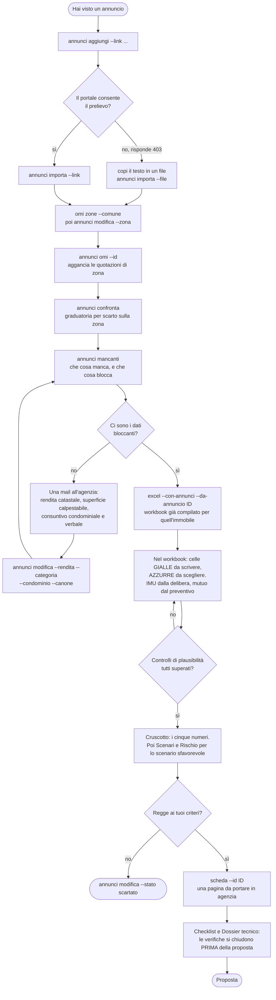
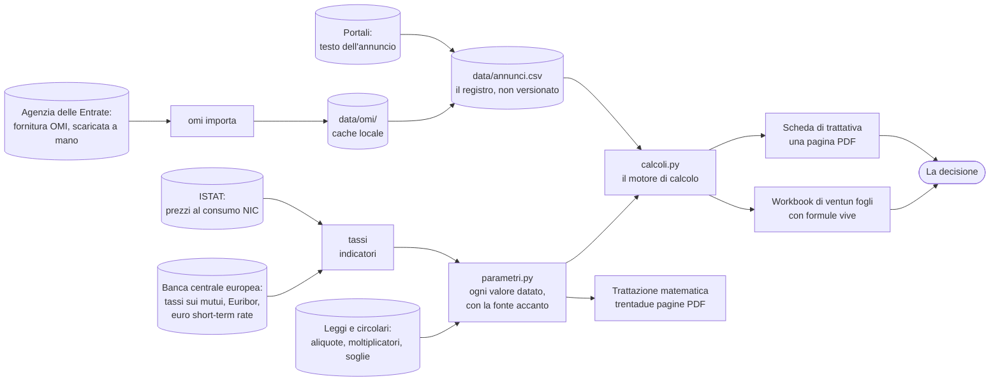

# Manuale operativo

> Guida d'uso completa: che cosa si installa, che cosa fa ogni comando con ogni sua opzione, che cosa si scrive in ogni campo del registro, che cosa si compila e che cosa si legge in ogni foglio del workbook, che cosa va rifatto periodicamente e che cosa significa ogni errore che si incontra. È il documento del *come*.

## Che cosa copre questo documento, e che cosa non copre

Questo file risponde alle domande operative: quale comando eseguire, quale opzione passare, quale cella compilare, in che ordine, e cosa fare quando qualcosa non funziona. Non spiega la materia, perché la materia è già spiegata altrove e ripeterla qui produrrebbe due versioni destinate a divergere.

Per spiegare lo strumento a chi compra insieme, e non ha il progetto sulla macchina, si manda `guida-per-il-socio.md`: è l'unico documento di questa cartella scritto per essere letto da fuori, e ripete quanto serve invece di rimandare altrove.

Per il perché di un numero si va nelle schede di dominio. Le imposte di trasferimento, il prezzo-valore, la prima casa, la detrazione degli interessi e l'IMU stanno in `fiscalita-acquisto.md`. I quattro regimi di tassazione del canone e le novità 2026 sulle locazioni brevi stanno in `fiscalita-locazione.md`. Le verifiche legali e urbanistiche stanno in `due-diligence.md`, i documenti da farsi consegnare in `perizia-pre-acquisto.md`, le vendite giudiziarie in `aste-immobiliari.md`, l'acquisto in più persone in `comprare-in-piu-persone.md`. Le scelte metodologiche, cioè quale denominatore usa un rendimento e perché, stanno in `metodo-e-metriche.md`. L'architettura del codice sta in `guida-tecnica.md`, la spiegazione senza gergo di ogni voce sta in `guida-non-tecnica.md`, il percorso rapido per la prima valutazione sta in `da-zero.md`, e la provenienza di ogni dato sta in `fonti.md`.

## Il percorso in un diagramma

Il primo diagramma è la sequenza operativa: che comando si lancia, in che ordine, e dove si esce dal terminale per entrare nel workbook. Si legge dall'alto.



Il secondo diagramma non è una sequenza ma una mappa: dice da dove viene ogni numero e dove finisce. Serve a rispondere alla domanda che si pone quando un risultato sorprende, cioè quale dato lo ha prodotto.



Due cose che i diagrammi rendono visibili e che vale enunciare. La prima è che ci sono due punti in cui il percorso esce dall'automatico e richiede una persona, e sono entrambi voluti: il prelievo di un annuncio quando il portale lo nega, e la fornitura OMI che vive dietro un'autenticazione personale. La seconda è che il motore di calcolo è uno solo e alimenta tre uscite diverse, il workbook, la scheda e la trattazione: è la ragione per cui un numero letto in uno dei tre deve coincidere con lo stesso numero letto negli altri due, e per cui questa coincidenza è verificata dai test invece di essere sperata.

## Installazione, una volta sola

Serve Python della serie 3.13 e una sola dipendenza, `openpyxl`. Tutto il resto è libreria standard.

```
python -m pip install openpyxl
```

Per la verifica del workbook serve Excel installato sulla macchina, perché la verifica consiste nell'aprire il file col programma che lo interpreterà davvero. Senza Excel il progetto funziona comunque: si perde solo quel controllo, e i test automatici restano eseguibili.

Per la strutturazione automatica di un annuncio incollato serve un'istanza di Ollama raggiungibile. È opzionale in senso forte: se non risponde, il comando lo dice e tutto il resto continua a funzionare. L'indirizzo predefinito è quello standard in locale e si sovrascrive con una variabile d'ambiente.

```powershell
$env:OLLAMA_HOST = "http://indirizzo-della-macchina:porta"
```

I test si eseguono con pytest, e se pytest non è installato i due file di test si lanciano direttamente, perché ciascuno porta in fondo un blocco che esegue le proprie funzioni e riporta il conto.

```
python -m pytest tests
python tests/test_calcoli.py
python tests/test_workbook.py
```

## La cartella, che cosa c'è dove

```
src/immobiliare/     la libreria: parametri, calcoli, generatore del workbook, registro,
                     OMI, tassi, indicatori, modello locale, scheda di trattativa
tools/               i due eseguibili: valuta.py, che e' la riga di comando, e
                     verifica-excel.ps1, che apre il workbook con Excel
scripts/             build e setup dell'ambiente LaTeX, quattro script
tests/               i due file di test
docs/                le schede di dominio e le guide in Markdown, compreso questo file
docs/matematica/     la trattazione LaTeX e il PDF che ne esce
data/annunci.csv     il registro degli immobili, non versionato
data/omi/            la fornitura delle quotazioni OMI, da aggiornare a semestre
output/              tutto cio' che il progetto genera, non versionato
  Valutazione-Immobile.xlsx    il workbook-modello, con i valori di esempio
  immobili/<id>/               una cartella per immobile: il workbook precompilato,
                               il sorgente della scheda e il suo PDF
_notes/              materiale personale, non versionato, con la mappa in INDICE-MATERIALE.md
.claude/             memoria di progetto, decisioni, schede di contesto, regole
```

Sulla divisione fra `src/` e `tools/` vale una riga, perche' e' una domanda ricorrente. Sotto `src/immobiliare/` sta la libreria, cioe' moduli che si importano e non si eseguono: e' il layout `src`, adottato perche' impedisce di importare per sbaglio il pacchetto dalla cartella di lavoro invece che da quello installato, che e' la causa piu' comune di test che passano in locale e falliscono altrove. Sotto `tools/` stanno invece i due eseguibili, cioe' cio' che si lancia: `valuta.py`, che e' l'unica interfaccia del progetto, e `verifica-excel.ps1`, che non e' nemmeno Python. Mettere `tools/` dentro `src/` mescolerebbe le due nature, e renderebbe `verifica-excel.ps1` un file PowerShell dentro un pacchetto Python.

Le cartelle `data/` e `output/` non stanno in git per ragioni diverse. `output/` perché si rigenera da un comando e peserebbe sulla storia. `data/annunci.csv` perché porta i link agli immobili in trattativa e la colonna del prezzo obiettivo, che è la propria strategia di acquisto e non ha ragione di stare in una repository pubblica; chi lavora in un repository privato può togliere la riga dal `.gitignore`.

## La trattazione matematica

La matematica del modello e' formalizzata in `docs/matematica/matematica-finanziaria.tex`, che si compila in un PDF di trentadue pagine con gli script del progetto. Serve la prima volta un passaggio di preparazione dell'ambiente, che installa TinyTeX e i pacchetti del manifesto `tex-packages.txt`.

```powershell
powershell -NoProfile -ExecutionPolicy Bypass -File scripts\setup-tex.ps1
powershell -NoProfile -ExecutionPolicy Bypass -File scripts\build.ps1 -Main docs\matematica\matematica-finanziaria.tex
```

```bash
bash scripts/setup-tex.sh
bash scripts/build.sh --main docs/matematica/matematica-finanziaria.tex
```

Il PDF finisce accanto al sorgente e non e' versionato, perche' e' un artefatto derivato. L'ambiente LaTeX serve soltanto a questo documento: il resto del progetto non ne dipende, e chi non lo compila non perde nulla del funzionamento dello strumento. La procedura e' incapsulata nella skill `latex-build` sotto `.claude/skills/`.

## Il ciclo di lavoro

Il percorso, in ordine, è questo. Si registrano gli immobili che si stanno guardando, anche solo con un link. Si aggancia a ciascuno la zona OMI, per sapere se il prezzo è dentro o fuori mercato. Si guarda la graduatoria e si scelgono i due o tre che meritano tempo. Sul candidato si compilano i fogli di input del workbook, si leggono il Cruscotto e gli scenari sfavorevoli, e si decide se ha senso fare una proposta. Se ha senso, si aprono la checklist e il dossier tecnico e si chiudono le verifiche prima di firmare, perché una proposta accettata è già un contratto.

Il workbook ha come primo foglio l'indice, che porta i venti fogli in ordine di lettura con un collegamento a ciascuno, e dice per ognuno se si compila o si legge, quando lo si apre e cosa ne esce. Da ogni foglio si torna all'indice col collegamento in alto a sinistra, appena sotto il titolo.

## I comandi, uno per uno

Tutti i comandi si lanciano dalla radice del progetto nella forma `python tools/valuta.py <comando>`. Ogni comando accetta `--help`.

### excel, genera il workbook

```
python tools/valuta.py excel
python tools/valuta.py excel --con-annunci
python tools/valuta.py excel --output "percorso/mio-file.xlsx"
```

Genera il workbook di ventun fogli in `output/Valutazione-Immobile.xlsx`. Con `--con-annunci` vi riversa anche il registro, scrivendo un immobile per riga nel foglio Annunci e preservando le tre colonne che contengono formule. Con `--output` si cambia la destinazione, cosa utile per tenere un file per immobile una volta scelto il candidato.

Con `--da-annuncio` il workbook nasce già compilato coi dati di un immobile a registro, e questo toglie il passaggio più pericoloso del percorso: la ridigitazione a mano. Scelto l'immobile dalla graduatoria, i suoi dati stavano nel registro e andavano ricopiati nei fogli di input, un lavoro di due minuti che introduce l'unica classe di errore contro cui il modello non ha difese, cioè la trascrizione. Un prezzo con una cifra in meno produce un'operazione che sembra ottima e nessuna cella va in errore per dirlo.

```
python tools/valuta.py excel --con-annunci --da-annuncio house_6 --output "output/house_6.xlsx"
```

La scrittura passa per i nomi definiti delle celle e non per le coordinate, quindi un nome scomparso fa fallire il comando con un messaggio invece di scrivere un prezzo in una cella di manutenzione; e rifiuta di scrivere in una cella che contiene una formula, perché la distinzione fra input e calcolo vive nel colore e non nel tipo.

Una cosa va capita perché è deliberata e sorprende: i campi che il registro non ha vengono **azzerati** e non lasciati al valore di esempio. Un workbook appena generato porta una rendita catastale di 450 euro che serve a mostrare il formato; in un file dedicato a un immobile reale quel valore farebbe applicare il prezzo-valore su una base inventata, e i controlli di plausibilità non se ne accorgerebbero perché guardano se il valore è zero, non se è vero. Azzerando, il foglio mostra un modello visibilmente incompleto invece di uno apparentemente sano, e i controlli del Cruscotto li segnalano tutti. Restano invece intatti i due campi del regime di acquisto e la base d'asta, perché lì il vuoto significa qualcosa.

Il comando va rieseguito dopo ogni modifica al registro e dopo ogni modifica al codice del generatore. Attenzione a una cosa che capita: se il file è aperto in Excel, la scrittura falla con un errore di permesso, e il processo va chiuso prima di rigenerare.

Rigenerare sovrascrive il file, quindi tutto quello che si è scritto a mano nelle celle gialle di quella copia si perde. Il modo di lavorare che regge è tenere il file generato come modello e salvarne una copia con un altro nome per l'immobile su cui si sta lavorando davvero.

### riepilogo, il calcolo a video senza Excel

```
python tools/valuta.py riepilogo --prezzo 120000 --rendita 450 --mq 55 --mutuo 90000 --tasso 0.032 --durata 25 --canone 500
```

Fa passare lo stesso caso per il motore Python e stampa i risultati a video. Serve a due cose: avere un numero in trenta secondi senza aprire nulla, e verificare che motore e workbook diano lo stesso risultato sullo stesso caso, che è il quarto livello di verifica del progetto.

Le opzioni descrivono l'immobile, l'acquirente, il finanziamento e la locazione. Sull'immobile: `--prezzo`, obbligatoria, `--rendita` per la rendita catastale, `--categoria` per la categoria catastale, `--mq`, `--comune`. Sul regime di acquisto: `--da-impresa` per l'acquisto soggetto a IVA, `--no-prima-casa` per rinunciare all'agevolazione, `--no-prezzo-valore` per non esercitare l'opzione, `--quota` per la quota di acquisto se si compra in più persone, `--reddito` per il reddito imponibile IRPEF che serve allo scaglione marginale. Sul mutuo: `--mutuo`, `--tasso` in forma decimale, cioè 0.032 e non 3.2, `--durata` in anni. Sui costi: `--provvigione`, `--notaio`, `--altri-costi`. Sulla destinazione: `--abitazione-principale` cambia IMU e detrazione. Sulla locazione: `--canone` mensile atteso, `--canone-concordato`, `--regime` fra i quattro, `--sfitto` in mesi l'anno, `--condominio` annuo, `--imu` come aliquota. Sulla proiezione: `--orizzonte` in anni e `--rivalutazione` annua dell'immobile.

Le due opzioni che cambiano il risultato più di quanto si aspetti sono `--rendita`, perché senza la rendita catastale il prezzo-valore non si applica e le imposte si calcolano sul prezzo intero, e `--no-prima-casa`, che moltiplica per quattro e mezzo l'imposta di registro.

### annunci, il registro degli immobili

Il comando ha otto azioni. La prima parola dopo `annunci` è l'azione.

```
python tools/valuta.py annunci elenca
python tools/valuta.py annunci confronta
python tools/valuta.py annunci aggiungi --link "https://..." --comune "..." --mq 60 --prezzo 120000
python tools/valuta.py annunci modifica --id house_3 --zona B5 --prezzo 118000
python tools/valuta.py annunci importa --file annuncio.txt
python tools/valuta.py annunci importa --link "https://..."
python tools/valuta.py annunci esporta
python tools/valuta.py annunci rimuovi --id house_7
python tools/valuta.py annunci omi --id house_3
```

`mancanti` risponde alla domanda che si pone a metà percorso: quale immobile è pronto per la valutazione e quale aspetta un dato. Non elenca i campi vuoti, che su trentacinque colonne sarebbero rumore, ma quelli che bloccano un calcolo, una riga per immobile, e in fondo mette una legenda che per ciascun campo dice che cosa blocca e come si ottiene. La legenda sta in fondo e non accanto a ogni riga perché quell'informazione è per campo e non per immobile: ripeterla trasformerebbe una risposta da dieci secondi in centoventisei righe.

`elenca` stampa il registro. `confronta` stampa la graduatoria ordinata per scarto sulla quotazione di zona e non per prezzo, perché fra immobili di taglia diversa il prezzo non dice nulla; accanto mostra il canone che la zona paga per quella superficie, ricavato dalle quotazioni OMI di locazione e non dall'annuncio, e una colonna di segnalazioni che ricava dalle note le bandiere rosse, cioè immobile locato, da ristrutturare, zona assegnata per ipotesi, dati incoerenti, rendita mancante, più la segnalazione della vendita soggetta a IVA che rende quella riga non commensurabile alle altre.

`aggiungi` crea una riga assegnando un identificativo progressivo se non lo si passa, e rifiuta i doppioni riconoscendo il link in forma normalizzata. Nessuna opzione è obbligatoria oltre a quelle che si vogliono valorizzare, quindi un immobile può entrare col solo link e completarsi dopo. `modifica` cambia i campi indicati su una riga esistente, e vuole `--id`. `rimuovi` cancella una riga, e vuole `--id`.

`importa` è l'unico punto in cui interviene il modello linguistico locale: prende il testo di un annuncio da un file con `--file`, oppure lo preleva da un indirizzo con `--link`, e ne ricava i campi strutturati. Con `--link` il prelievo avviene solo se il `robots.txt` del portale lo consente, e diversi portali non lo consentono o rispondono comunque negando l'accesso a un client che non sia un browser: in quel caso si copia il testo dalla pagina in un file e si usa `--file`, che è la via che funziona sempre. Del testo il modello legge la testa e la coda, non solo l'inizio, perché è in fondo alle pagine dei portali che stanno le tabelle con spese condominiali, classe energetica, rendita e categoria.

`esporta` riversa il registro nel workbook, e fa la stessa cosa che fa `excel --con-annunci` senza rigenerare il file: serve quando si è compilato a mano qualcosa nel workbook e non si vuole perderlo.

`omi` aggancia a un annuncio la quotazione della sua zona, e vuole `--id`. Se la zona non è ancora nota si trova prima con `omi zone`.

Le opzioni dei campi sono `--id`, `--link`, `--comune`, `--provincia`, `--indirizzo`, `--tipologia`, `--destinazione` per la destinazione d'uso, `--fonte`, `--agenzia`, `--contatto`, `--nuova` per la nuova costruzione, `--consegna` per la data prevista o la parola pronto, `--mq`, `--prezzo` per il richiesto, `--obiettivo` per il prezzo che si vuole mettere in proposta, `--canone` mensile atteso, `--note`, `--stato`, `--punteggio` da zero a dieci, `--zona` per la zona OMI e `--tipologia-omi` per la tipologia edilizia dell'Osservatorio.

A queste si aggiungono le opzioni dei campi che `mancanti` segnala come bloccanti, e che fino al 2 settembre 2026 non erano scrivibili se non aprendo il CSV a mano: `--rendita` per la rendita catastale, che è quella che sblocca il prezzo-valore, `--categoria` per la categoria catastale, `--condominio` per le spese condominiali annue dal consuntivo, `--piano`, `--classe` per la classe energetica, `--prima-casa` e `--impresa` per i due campi del regime di acquisto, che accettano SI o NO e che omessi lasciano il terzo stato, e `--quotazione-min` con `--quotazione-max`, che di norma scrive `annunci omi` e che si passano a mano solo se si legge la quotazione dal sito invece di ingerire la fornitura. Un comando che chiede un dato e non lo accetta è un percorso interrotto a metà, ed è la ragione per cui queste opzioni esistono.

### omi, le quotazioni dell'Osservatorio

```
python tools/valuta.py omi zone --comune "Civitanova Marche"
python tools/valuta.py omi cerca --comune "Civitanova Marche" --zona B5
python tools/valuta.py omi cerca --comune "Macerata" --zona C5 --tipologia "Abitazioni civili"
python tools/valuta.py omi importa --file "percorso/QI_xxxxx.zip"
python tools/valuta.py omi scarica --semestre 2018-2
```

`zone` elenca le zone omogenee di un Comune con la loro descrizione, e serve a scegliere quella giusta prima di agganciarla a un annuncio. Le descrizioni sono letterali, quindi capita di trovare la corrispondenza esatta col nome del quartiere scritto nell'annuncio.

`cerca` stampa le quotazioni di compravendita e di locazione della zona, con minimo e massimo al metro quadro, e in coda l'attribuzione della fonte che la fornitura impone di citare.

`importa` ingerisce la fornitura ufficiale scaricata a mano, e accetta l'archivio zip così come arriva oppure i CSV già estratti. È la sola via per i dati correnti, perché la fornitura vive dietro un'autenticazione personale con SPID, CIE, Entratel o Fisconline, che uno script non può e non deve simulare.

`scarica` prende i dati dal mirror open data su GitHub, che si ferma al secondo semestre 2018 ed è quindi utile per la serie storica e non per il valore corrente.

Sui nomi dei Comuni: il confronto è tollerante, perché nella fornitura ufficiale gli apostrofi e i prefissi agiografici sono scritti in modi diversi, quindi non serve indovinare la grafia esatta.

### tassi, il mercato e la sua storia

```
python tools/valuta.py tassi
python tools/valuta.py tassi --tasso 0.032 --mutuo 90000 --durata 25
python tools/valuta.py tassi --tasso 0.032 --serie variabile
python tools/valuta.py tassi --risalita
python tools/valuta.py tassi --risalita --indice euribor_6m
```

Senza opzioni stampa i tassi correnti sulle nuove erogazioni in Italia, presi dalle statistiche armonizzate della Banca centrale europea, più l'Euribor a tre e sei mesi.

Con `--tasso` confronta il TAN di un preventivo con la media della sua tipologia e traduce lo scarto in euro di interessi sull'intera durata, che è l'unica forma in cui un decimo di punto diventa una cifra su cui trattare. Il tasso si passa in forma decimale. `--mutuo` e `--durata` servono a quantificare lo scarto, `--serie` sceglie la tipologia di riferimento fra media, variabile, rifissazione fra uno e cinque anni, fra cinque e dieci, e fisso oltre dieci: il confronto sensato si fa con la propria tipologia, non con la media generale.

Con `--risalita` stampa quanto l'indice è salito nelle peggiori finestre della sua storia, dodici, ventiquattro e trentasei mesi, con il periodo in cui è avvenuto e i livelli di partenza e arrivo, e confronta il risultato con i valori congelati nel codice che alimentano le note del foglio Simulatore mutuo, dicendo se sono ancora quelli. È il numero da mettere nel percorso del tasso quando si valuta un mutuo a tasso variabile, e non va confuso con una previsione: è il peggio che i dati contengono.

Il comando stampa sempre, anche senza opzioni, la sezione che scompone il tasso negli anelli che lo determinano: l'euro short-term rate, che è il costo del denaro a un giorno fra banche calcolato dalla BCE sulle transazioni davvero avvenute; l'Euribor a tre mesi, cioè lo stesso mercato su una durata di tre mesi, il cui scarto sull'overnight è il prezzo della durata più il rischio di controparte e riflette dove il mercato si aspetta che vada la politica monetaria; la media di quello che le banche italiane hanno davvero applicato alle nuove erogazioni, il cui scarto sull'indice è il margine del sistema bancario, cioè costo del capitale di vigilanza, rischio di credito, costi operativi e profitto; e infine, se si passa `--tasso`, il proprio preventivo, il cui scarto sulla media è l'unico anello su cui si tratta. Gli anelli non sono contemporanei, perché le tre serie hanno frequenze e ritardi diversi, quindi gli scarti si leggono come ordini di grandezza; e un mutuo a tasso fisso è indicizzato all'IRS di pari durata e non all'Euribor, quindi sul fisso la catena vale come scomposizione concettuale e non come somma esatta.

### indicatori, per tarare le assunzioni

```
python tools/valuta.py indicatori
```

Stampa l'euro short-term rate, cioè il tasso overnight dell'area euro pubblicato ogni giorno lavorativo, e l'inflazione italiana nelle due misure disponibili, l'indice armonizzato della BCE e i prezzi al consumo NIC di ISTAT. Serve a decidere che numero mettere nell'inflazione attesa del modello invece di lasciare il valore predefinito. Ogni valore esce col suo periodo, e il periodo va guardato: le serie mensili hanno settimane di ritardo, e una serie ferma a un dicembre significa che il dato corrente sta in un flusso diverso, non che l'inflazione si sia fermata.

### llm, lo stato del modello locale

```
python tools/valuta.py llm stato
```

Dice se l'istanza Ollama configurata risponde e quali modelli espone. Va usato quando `annunci importa` falla, per capire se il problema è il modello o il testo.

### scheda, una pagina per la trattativa

```
python tools/valuta.py scheda --id house_6
python tools/valuta.py scheda --id house_6 --mutuo 110000 --tasso 0.031 --durata 25 --imu 0.0106
python tools/valuta.py scheda --id house_6 --obiettivo 0.05 --output "output/immobili/house_6/con-mutuo-piu-alto.tex"
```

Produce il sorgente LaTeX di una scheda di una pagina, da compilare con gli script del progetto e da portare in agenzia. Serve a un momento preciso: quando si telefona al venditore o si entra in agenzia, e servono in mano quattro numeri e un elenco. I numeri sono il costo reale dell'operazione, che non è il prezzo, il rendimento netto reale, il prezzo massimo che l'immobile giustifica ai propri criteri e lo sconto che ne consegue. L'elenco è quello dei dati che mancano, perché la telefonata serve anche a chiederli.

Le opzioni sono i dati che il registro non porta e che cambiano il risultato: `--mutuo`, `--tasso` e `--durata` dal preventivo, `--imu` dalla delibera del Comune, `--obiettivo` per il rendimento netto sotto il quale l'operazione non ha senso. Senza `--imu` la scheda usa l'aliquota base di legge e lo dichiara nel piede, invece di lasciarla passare per un dato.

Due comportamenti sono voluti. La scheda calcola col motore Python e non legge il workbook, quindi è un terzo riscontro della stessa matematica e non una copia. E i numeri che dipendono da un dato assente non vengono stampati: senza canone atteso, per esempio, il prezzo massimo non è calcolabile e la casella lo dice invece di contenere una cifra. La prima versione la conteneva, e su un immobile senza canone annunciava uno sconto da ottenere del centoquattro per cento del prezzo: aritmeticamente corretto, operativamente assurdo.

Il file finisce in `output/immobili/<id>/`, insieme al workbook precompilato dello stesso immobile, così che tutto ciò che riguarda una casa stia in una cartella sola. Quella cartella non è versionata, ed è voluto: la scheda porta il prezzo obiettivo, che è la propria strategia di acquisto.

### verifica-excel.ps1, il controllo del workbook

```
powershell -NoProfile -ExecutionPolicy Bypass -File tools\verifica-excel.ps1
powershell -NoProfile -ExecutionPolicy Bypass -File tools\verifica-excel.ps1 "percorso\altro-file.xlsx"
```

Apre il file con Excel, forza un ricalcolo completo, elenca ogni cella che valuta a errore con la formula che l'ha prodotta, e stampa i valori chiave e le sezioni di sintesi. Termina con codice diverso da zero se trova errori, quindi è usabile come cancello prima di un commit.

Va eseguito dopo ogni modifica al generatore, e la ragione va capita perché non è ovvia: la libreria che scrive il file scrive le formule senza valutarle, quindi può produrre un file sintatticamente valido e funzionalmente rotto senza che Python protesti. Un nome definito inesistente, una parentesi sbagliata o un blocco XML vuoto passano tutti il controllo del generatore.

## Il registro degli annunci, campo per campo

Il registro è un CSV con punto e virgola come separatore, che è quello che Excel italiano apre senza chiedere nulla; in lettura riconosce anche la virgola, per i file arrivati da altrove. Ogni riga è un immobile, e le colonne sono trentacinque.

| Campo | Chi lo compila | Che cosa ne dipende |
|---|---|---|
| `id` | assegnato automaticamente, `house_N` | l'aggancio fra registro e foglio di confronto |
| `data` | automatica, la data di inserimento | niente, è memoria |
| `stato` | a mano, uno dei sette valori ammessi | il filtro per stato nel foglio |
| `fonte` | automatica dal dominio del link | niente, è memoria |
| `agenzia`, `contatto` | a mano | niente nel calcolo: è il riferimento con cui si sta trattando |
| `link` | a mano | il riconoscimento dei doppioni, che avviene sul link normalizzato |
| `comune`, `provincia` | a mano | l'aggancio alle quotazioni OMI e la delibera IMU da cercare |
| `zona_omi` | da `omi zone`, poi a mano | tutte le quotazioni di zona e lo scarto: senza, lo scarto si calcola sull'intero Comune e dice poco |
| `indirizzo` | a mano | niente, ma serve a scegliere la zona |
| `tipologia` | a mano o dal modello | niente nel calcolo |
| `destinazione_uso` | a mano o dal modello | nulla nel calcolo, ma un immobile accatastato a ufficio non è un'abitazione e cambia imposte e residenza |
| `nuova_costruzione`, `data_consegna` | a mano o dal modello | le tutele del d.lgs. 122/2005 nel dossier tecnico |
| `mq` | a mano o dal modello | prezzo al metro quadro, quindi lo scarto sulla zona e l'intera graduatoria |
| `prezzo_richiesto` | a mano o dal modello | prezzo al metro quadro, rendimento lordo, scarto |
| `prezzo_obiettivo` | a mano, è la propria strategia | il prezzo che il foglio di confronto usa in tutti i calcoli, quando è compilato |
| `quotazione_omi_min`, `quotazione_omi_max` | da `annunci omi` | lo scarto sulla zona |
| `rendita_catastale` | a mano, va chiesta | il prezzo-valore, che è la leva fiscale più grossa dell'operazione |
| `categoria` | a mano | il moltiplicatore catastale e l'esclusione dall'agevolazione per le categorie di lusso |
| `piano`, `classe_energetica` | a mano o dal modello | niente nel calcolo |
| `spese_condominio_anno` | dal consuntivo condominiale | i costi operativi nel foglio di confronto |
| `canone_atteso_mese` | a mano | rendimento lordo, ricavo effettivo, tutto il conto economico |
| `asta` | a mano | segnala che quella riga va valutata col foglio Asta e non col modello ordinario |
| `base_asta`, `data_asta`, `tribunale_procedura`, `stato_occupazione` | dall'avviso di vendita | il foglio Asta e la valutazione dei quattro rischi che il prezzo deve pagare |
| `punteggio` | a mano, da zero a dieci | l'ordine in cui si vogliono guardare gli immobili, a parità di scarto |
| `note` | a mano | le segnalazioni della graduatoria, che ne ricavano le bandiere rosse |
| `prima_casa` | a mano, SI, NO o vuoto | le imposte di trasferimento di quella riga |
| `venditore_impresa` | a mano o dal modello, SI, NO o vuoto | IVA invece di imposta di registro su quella riga |

Sui due campi in fondo va detto come funziona il vuoto, perché non è un NO. Lasciarli vuoti significa che quella riga eredita il regime impostato nel foglio Immobile, quindi un registro compilato senza toccarli si comporta come se non esistessero. Si compilano quando la lista mescola immobili con regimi diversi, tipicamente un usato da privato accanto a un nuovo da costruttore: senza, le imposte sono calcolate uguali per tutti e la graduatoria indica come migliore proprio l'immobile che porta l'imposta più alta.

I valori dei campi a tre stati si normalizzano in ingresso, quindi `si`, `s`, `yes`, `true`, `vero` e `1` diventano SI e i corrispondenti negativi diventano NO. Il vuoto resta vuoto, e quello che non è riconosciuto resta scritto com'è, perché un valore strano che si vede è preferibile a un valore strano tradotto per ipotesi.

Tre colonne del foglio Annunci non vanno mai scritte, perché contengono formule: il prezzo al metro quadro, lo scarto sulla quotazione OMI e il rendimento lordo. L'esportazione le salta, e un test verifica che continui a saltarle.

## Come il registro parla con il workbook, e in che direzione

È la domanda che si pone chiunque veda due posti dove stanno gli stessi dati, e la risposta ha una direzione sola.

Il registro `data/annunci.csv` è la sorgente. Il comando `excel --con-annunci`, e il suo equivalente `annunci esporta` che non rigenera il file, copiano il registro nel foglio Annunci del workbook, una riga per immobile, saltando le tre colonne che contengono formule. Il foglio Confronto immobili non contiene dati: ogni sua cella è una formula che legge la riga corrispondente del foglio Annunci, quindi si popola da sé man mano che il registro si riempie.

Il passaggio inverso non esiste. Scrivere nel foglio Annunci del workbook non aggiorna il CSV, e alla successiva esportazione quelle modifiche vengono sovrascritte. È una scelta e non una mancanza: il registro è l'archivio, il workbook è una vista dell'archivio, e avere due sorgenti che si scrivono a vicenda produrrebbe conflitti che nessuno riesce a districare. Se si vuole correggere un dato, si corregge nel registro.

Sul come si scrive nel registro ci sono due vie. La riga di comando, con `annunci aggiungi` e `annunci modifica`, ed è quella prevista: assegna l'identificativo progressivo, rifiuta i doppioni riconoscendo il link normalizzato, normalizza i campi a tre stati e non permette di scrivere in una colonna sbagliata. Oppure il CSV a mano, aprendolo con un editor di testo o con Excel: funziona, il separatore è il punto e virgola, e nessuno lo vieta, ma si perdono i quattro controlli di cui sopra e si rischia di spostare una colonna. Per un dato singolo su un immobile esistente la riga di comando è più rapida di aprire il file.

## Il workbook, foglio per foglio

Il primo foglio è l'indice e riporta questa stessa informazione in forma navigabile. La tabella qui sotto la ripete per chi lavora da terminale.

| Foglio | Si compila o si legge | Quando |
|---|---|---|
| Guida | si legge | è l'indice, con un collegamento a ogni foglio |
| Cruscotto | si legge | sempre, per primo e per ultimo |
| Immobile | si compila | quando c'è un candidato |
| Mutuo | si compila | subito dopo Immobile |
| Locazione | si compila | solo se l'immobile si mette a reddito |
| Comproprieta | si compila | solo se si compra in più di uno |
| Ammortamento | si legge | dopo aver compilato Mutuo |
| Simulatore mutuo | si compila e si legge | prima di firmare un mutuo, soprattutto variabile |
| Cash flow | si legge | dopo Locazione |
| Metriche | si legge | quando gli input sono completi |
| Confronto affitto | si legge | solo per l'abitazione propria |
| Scenari | si compila e si legge | prima di decidere, mai dopo |
| Rischio | si legge | insieme a Scenari |
| Checklist | si compila | dal passaggio alla proposta |
| Dossier tecnico | si compila | prima della proposta, non dopo |
| Asta | si compila e si legge | solo per le vendite giudiziarie |
| Annunci | si compila | da subito, appena si inizia a guardare |
| Confronto immobili | si legge | quando a registro c'è più di un immobile |
| Parametri | si consulta | all'aggiornamento fiscale, o per capire da dove viene un numero |
| Fonti | si consulta | prima di fidarsi di un numero |

Il ventunesimo foglio, `_Estrazioni`, è nascosto e contiene le mille estrazioni casuali della simulazione, generate una volta sola con un seme dichiarato. Non c'è nulla da leggerci e non va toccato: è ciò che rende la simulazione riproducibile invece di cambiare a ogni ricalcolo.

## I controlli di plausibilità

Il Cruscotto porta in testa un contatore, "Controlli di plausibilità non superati", e in fondo la sezione che li elenca uno per uno. Il modello non può sapere se un input è giusto, ma può sapere tre cose: se è ancora quello di esempio, se è a zero dove uno zero non è plausibile, e se è incoerente con un'altra scelta. Gli otto controlli sono di questo tipo, e ciascuno dice che cosa comporta il valore trovato e come si chiude.

Il più importante è il primo: rendita catastale a zero mentre l'opzione prezzo-valore è attiva. In quel caso l'opzione non si applica, le imposte si calcolano sul prezzo intero, e si sta perdendo in silenzio la leva fiscale più grossa dell'operazione. Il secondo è l'aliquota IMU ancora al valore base di legge, che i Comuni possono azzerare o portare all'1,06 per cento: sul valore base l'IMU stimata può sbagliare di un quarto, ogni anno per tutta la durata del possesso.

Nessun controllo blocca il calcolo, e il punto è proprio quello: il foglio produce numeri anche su input di esempio, e un numero calcolato su un input di esempio ha la stessa faccia di uno calcolato su un dato vero. Un controllo non superato non è un errore del modello, è un input che non è ancora un dato.

## Le convenzioni del workbook

I colori dicono cosa toccare. Il giallo è un input da compilare, il grigio è una cella calcolata, il verde è un risultato di sintesi, il rosso è un'attenzione. Si scrive solo nel giallo.

I riferimenti fra fogli passano per nomi definiti e non per coordinate di cella. La conseguenza pratica per chi usa il file è che inserire o cancellare righe nei fogli di input è più sicuro di quanto sarebbe altrimenti, ma resta sconsigliato: le tabelle lunghe, come il piano di ammortamento e le estrazioni, hanno intervalli nominati che coprono un numero fisso di righe.

Le due voci da non lasciare mai al valore predefinito sono l'aliquota IMU, che va letta nella delibera del Comune per l'anno in corso, e le spese condominiali, che vanno prese dal consuntivo degli ultimi due esercizi e non dalla stima dell'agenzia. Insieme al consuntivo vanno letti i verbali delle assemblee, perché i lavori deliberati e non ancora fatti sono un costo che arriva dopo il rogito.

## Le due cartelle sotto data, e cosa ci si fa

`data/annunci.csv` è il registro: un immobile per riga, trentacinque colonne, separatore punto e virgola. Non è versionato, perché porta i link agli immobili in trattativa e la colonna del prezzo obiettivo, che è la propria strategia di acquisto.

`data/omi/` è la cache delle quotazioni dell'Osservatorio, ed è la cartella da aggiornare due volte l'anno. Al 2 settembre 2026 contiene tre cose. La fornitura ufficiale del secondo semestre 2025, cioè `QI_1422845_1_20252_VALORI.csv` e il suo file delle zone, che è il dato corrente da cui il modello legge. Il mirror open data del secondo semestre 2018, i due file con il suffisso `utf8`, che resta soltanto per la serie storica e non va usato per valutare. E l'archivio zip da cui la fornitura è stata estratta, che si può cancellare senza conseguenze.

L'aggiornamento è manuale per una ragione che non è tecnica: la fornitura vive dietro un'autenticazione personale con SPID, CIE, Entratel o Fisconline, e le condizioni che si accettano usando quel servizio rendono l'utente responsabile dell'uso improprio, con l'inibizione dell'accesso come sanzione. Uno script non deve simulare quell'autenticazione. Si scarica a mano l'archivio e lo si ingerisce con `omi importa --file`, che accetta lo zip così come arriva.

## Manutenzione ricorrente

Le scadenze sono tre e nessuna è automatica.

Una volta l'anno, dopo la legge di bilancio, l'aggiornamento fiscale: si aggiornano i valori in `src/immobiliare/parametri.py` verificandoli sulle fonti di `fonti.md`, si sposta la costante `REVISIONE`, si aggiornano le schede di dominio impattate, si eseguono i test e la verifica del workbook, e si rigenera. I test congelano gli scaglioni IRPEF, il minimo di legge dell'imposta di registro e i moltiplicatori catastali, che sono le tre cose che cambiano più spesso e che passerebbero inosservate.

Due volte l'anno, a semestre chiuso, le quotazioni OMI: si scarica a mano la fornitura ufficiale dall'area riservata dell'Agenzia delle Entrate e la si ingerisce con `omi importa --file`. Sono cinque minuti e vanno messi in calendario, perché altrimenti non si fanno.

Quando i tassi si sono mossi, le risalite dell'Euribor: si esegue `tassi --risalita` e si guarda se i valori congelati nel codice sono ancora quelli. Se una finestra peggiore è comparsa, si aggiorna `RISALITE_EURIBOR` in `parametri.py`, si sposta il suo campo `verificato_il`, che è indipendente dalla revisione fiscale, e si rigenera il workbook, perché le note del foglio Simulatore mutuo citano quei numeri.

## Verifica dopo una modifica al codice

Nell'ordine: i test, la rigenerazione, la verifica con Excel.

```
python -m pytest tests
python tools/valuta.py excel --con-annunci
powershell -NoProfile -ExecutionPolicy Bypass -File tools\verifica-excel.ps1
```

Se la modifica riguarda una funzionalità che dipende da un input dell'utente, la verifica formale non basta, perché dice solo che nessuna cella è in errore e una formula corretta che legge la cella sbagliata passa quel controllo. Serve una prova di comportamento, cioè aprire il file, scrivere gli input, ricalcolare e leggere l'esito. Il modo di farlo, con le prove già eseguite e i valori che devono uscire, sta in `.claude/context/dev-testing.md`.

## Diagnostica

**La rigenerazione falla con un errore di permesso sul file.** Excel tiene il file aperto. Va chiuso il processo, compresa un'eventuale istanza senza finestra rimasta appesa da una verifica precedente.

**La verifica con Excel dice che il metodo Open non esiste.** L'automazione COM espone i metodi nella lingua di installazione, e con una console italiana il late binding non li risolve: la chiamata va fatta forzando la cultura `en-US`, come fa lo script. Lo stesso messaggio si ottiene però anche quando il metodo esiste ma il file è malformato, quindi la causa va isolata provando ad aprire un file banale.

**Il workbook non si apre affatto.** Si generano workbook progressivi con un foglio in più alla volta e si prova ad aprirli tutti: il primo che falla identifica il foglio responsabile. È così che è stato trovato un elemento di validazione dichiarato e mai associato ad alcuna cella, che produceva un blocco XML vuoto.

**`annunci importa --link` non prende nulla.** Il portale nega l'accesso a un client che non sia un browser, oppure il suo `robots.txt` non consente il prelievo. Si copia il testo della pagina in un file e si usa `--file`.

**`annunci importa` falla con il modello non disponibile.** Si verifica con `llm stato`. Se l'istanza è su un'altra macchina, va esportata la variabile `OLLAMA_HOST`.

**`omi cerca` non trova il Comune.** Il confronto sui nomi è tollerante, quindi la causa più probabile è che la fornitura in cache non copra quella provincia, oppure che si stia cercando in un semestre che non è quello caricato. Si controlla con `omi zone` sullo stesso Comune.

**Lo scarto sulla zona OMI è enorme in valore assoluto.** Se la zona non è compilata, le quotazioni sono quelle dell'intero Comune, che è una forbice larghissima, e lo scarto non significa niente. Si assegna la zona con `omi zone` e poi `annunci omi`.

**Il foglio Simulatore mutuo dice che il piano non si chiude.** Non è un errore del foglio. Sotto l'effetto che riduce la durata un rialzo forte del tasso allunga il piano invece di alzare la rata, e il piano modellato si ferma a quarant'anni: in quel caso durata effettiva e interessi totali sono troncati e non risolti. Per il variabile italiano l'effetto corretto è quello che riduce la rata.

**La cella di verifica del prezzo massimo non è zero.** Si è fuori dal tratto in cui il costo totale è lineare nel prezzo, e il caso noto è il minimo di legge dell'imposta di registro, che su prezzi molto bassi diventa vincolante. Il prezzo massimo resta indicativo e va letto sapendolo.

**Un collegamento dell'indice non porta da nessuna parte.** Vuol dire che un foglio è stato rinominato a mano nella propria copia. I collegamenti puntano al nome del foglio, e un test verifica che nel file generato indice e fogli coincidano, ma su una copia modificata a mano quella garanzia non c'è.

## Cosa non fare

Non si scrive nelle celle grigie e verdi: sono calcolate, e sovrascriverle rompe la catena senza segnalare nulla.

Non si scrive nelle tre colonne di formula del foglio Annunci, cioè prezzo al metro quadro, scarto su OMI e rendimento lordo.

Non si aggira la protezione di un portale per prelevare un annuncio. Non è una questione di difficoltà tecnica ma di perimetro, ed è una decisione registrata del progetto: quando il prelievo automatico non è consentito, si copia il testo a mano.

Non si simula l'autenticazione ai servizi telematici dell'Agenzia delle Entrate per scaricare la fornitura OMI. L'accesso richiede un'autenticazione personale, e le condizioni che si accettano usandolo rendono l'utente responsabile dell'uso improprio, con l'inibizione del servizio come sanzione.

Non si prende il numero finale come un responso. Il modello dichiara le proprie assunzioni e i propri limiti in ogni foglio, e l'uso corretto non è leggere l'ultima riga ma capire quanto è distante il pareggio dalle ipotesi in cui si crede. Prima di firmare, le posizioni soggettive vanno confermate da un notaio e da un commercialista, e la conformità urbanistica da un tecnico abilitato.
